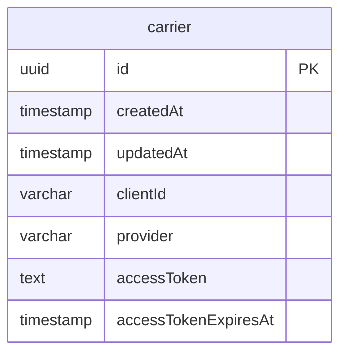

# UPS Integration Service

## Local Setup

### 1. Start Infrastructure

```bash
docker compose up -d
```

Starts PostgreSQL (`5432`) and Redis (`6379`) in the background.

To reset infrastructure and clear all data later:

```bash
docker compose down -v && docker compose up -d
```

`-v` removes volumes, which clears database data and Redis queues.

### 2. Configure Environment

From `apps/server`:

```bash
cp .env.example .env
```

Update UPS-specific variables in `apps/server/.env`:

```env
UPS_CLIENT_ID=ups-client-id
UPS_CLIENT_SECRET=ups-client-secret
UPS_MERCHANT_ID=ups-merchant-id
UPS_CLIENT_CREDENTIALS_ENDPOINT=https://wwwcie.ups.com/security/v1/oauth/token
UPS_RATING_ENDPOINT=https://wwwcie.ups.com/api/rating/v2409
```

### 3. Install Dependencies

From repository root:

```bash
pnpm install
```

Installs all project dependencies.

### 4. Run Database Migrations

From repository root:

```bash
npx nx migration:deploy server
```

Creates database schemas and tables in PostgreSQL.

### 5. Start Application

From repository root:

```bash
npx nx start server
```

Server starts at `http://localhost:3000`.

### 6. Run Tests

Run the UPS rate service spec:

```bash
npx nx test server --testPathPatterns="ups-rate.service.spec"
```

## Database Diagram (ERD)

Source file: `apps/server/DB_ERD.md`



## Access Points

- Application: `http://localhost:3000`
- Health Check: `http://localhost:3000/v1/health`
- API Docs (Swagger): `http://localhost:3000/v1/swagger`
- Redis UI: `http://localhost:8001`
